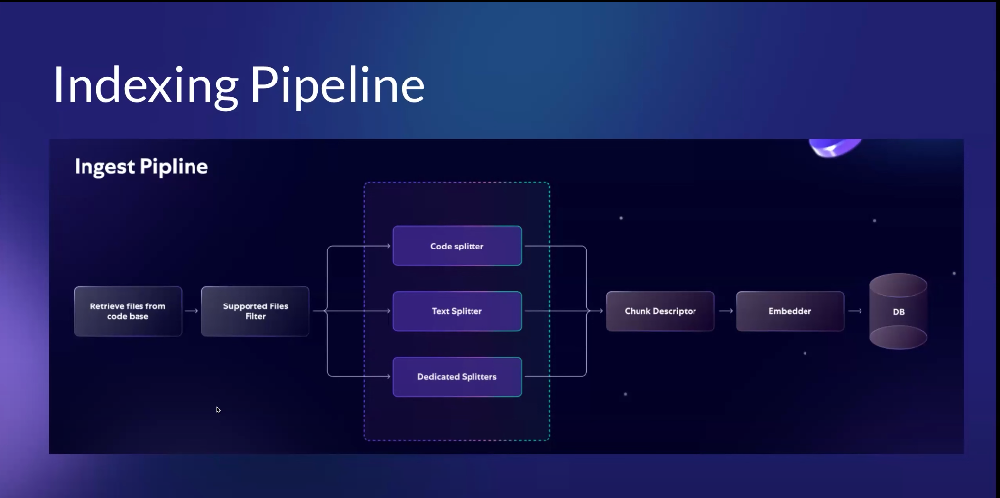

# Chunking

The goal of selecting the best chunking strategy is to make each chunk as **meaningful and complete** as possible.  
Semantically similar code should stay together so that a chunk represents a full, coherent unit.  
This is our final goal.

Any vector store requires chunking large documents for effective search.  

---

## Why not store whole files in vector databases?

- **Context windows of models**: LLMs can only process a limited number of tokens.  
- **Smaller & concise chunks**: They better match a specific user query and avoid irrelevant noise.  
- **Ideal strategy**: Use the smallest possible chunk that still contains all relevant context.

---

## Suitable Chunk Size for Open Source Model Context Windows

- Current open-source LLMs have **context windows ranging from 512 to 1500 tokens**.  
- Approximate ratio: **1 token ≈ 5 characters**.  
- To fit within context windows, chunk size should be **~1500–6500 characters** (excluding prompt tokens).  

This provides flexibility when adjusting chunk sizes according to model limits.

---

## How can we chunk code files?

There are 4 main strategies:

1. **Heuristic (fixed size)**  
2. **Rule-based (using delimiters)**  
3. **Overlapping (sliding window)**  
4. **Syntax-aware chunking (AST-based)**  

Problems with first two:  
- Heuristic & rule-based approaches **ignore semantics** and split code incorrectly.  

Best approach: **Syntax-aware chunking**  
- Convert code file into **AST (Abstract Syntax Tree)**.  
- Recursively chunk AST nodes.  

Steps:  
1. Generate AST structure.  
2. Chunk syntax tree nodes recursively.  

More info: [Syntax-aware method reference](#resources)

---

## Getting the Best Out of Chunks

- **Denoising**: Keep the smallest possible relevant chunk.  
- **Coalescing**: Remove whitespace.  
- **Targeted noise handling**: Fix large, deeply nested code by recursive breaking and reconstructing.  
- **Large methods**: If a single syntax node exceeds context window → slice it.  
- **Dynamic chunk sizing**: Start with 512 tokens, but adjust to fit context window.  
- **Overlapping**: Improve retrieval coverage.  
- **Enhanced embeddings**: Add natural language descriptions.  

> Note: When embedding, store both **vectors + raw chunks**, since numbers alone cannot guide generative models effectively.

---

## Strategies for Large Code Repositories

- **Repo-level filtering**: Focus on “golden repos”.  
- **Selective parsing**: Only parse MeTTa files.  
- **Different splitters**: For docs vs code.  

---

## Large Scale Data Ingestion Pipeline Plan



---

## Problems

- **MeTTa AST parser** lacks rich syntax detail.  
- Missing **SyntaxNodeTypes** (e.g., functions, rules, asserts).  
- To achieve **semantically contained chunks in MeTTa**, new node types may be required.  

### Ideas
- Use LLMs to infer file purpose (based on filename or folder name) → store in relational DB.  
- Consider **Knowledge Graph / AtomSpace** as alternative to AST (more aligned with MeTTa philosophy).  

---

## Resources  

- [Chunking 2M Files (Sweep Docs, archived)](https://web.archive.org/web/20240413093103/https://docs.sweep.dev/blogs/chunking-2m-files)
- [RAG For a Codebase with 10k Repos](https://www.qodo.ai/blog/rag-for-large-scale-code-repos/)  
- [cAST: Enhancing Code Retrieval-Augmented Generation with Structural Chunking via Abstract Syntax Tree](https://arxiv.org/pdf/2506.15655)

---

## Running the Chunker

```bash
# Create virtual environment
python -m venv .venv

# Install dependencies
pip install -r requirements.txt

# Build with maturin
cd metta_parser
maturin develop

# Run chunker
cd ../
python chunker.py [input_file_path] [output_file_path] --max-size 1500

# Check inputs & outputs in /data
# Adjust --max-size to experiment with chunk sizes
